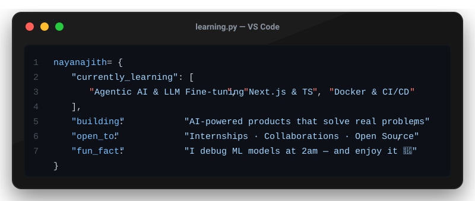

<div align="center">

  <picture>
    <source media="(prefers-color-scheme: dark)" srcset="profile_card.svg" />
    
  </picture>

</div>

---

### 🌐 Connect with me

<p align="left">
  <a href="https://www.linkedin.com/in/nayanajith-rajapaksha">
    
  </a>&nbsp;
  <a href="mailto:nayanajithrajapaksha75@gmail.com">
    
  </a>&nbsp;
  <a href="https://github.com/nayanajithRajapaksha">
    
  </a>
</p>

---

### 🛠️ Languages & Tools

<div align="center">
  
</div>

---

### 📋 About Me

```bash
$ cat profile.txt

  Name     :  Chathuranga Nayanajith Rajapaksha
  Degree   :  BSc (Hons) Information Technology — AI Specialization
  Uni      :  Sri Lanka Institute of Information Technology (SLIIT)
  Year     :  3rd Year, Semester 1
  Intern   :  AI/ML Engineer @ EgoTechWorld (Pvt) Ltd  [ July 2026 → Present ]
  Location :  Udapussellawa, Nuwara-Eliya, Sri Lanka 🇱🇰
  Passion  :  Agentic AI • Machine Learning • Full-Stack Development
  Quote    :  "Build things that matter. Ship things that work." 🚀
```

---

### 📫 Contact

| | |
|---|---|
| 📧 **Email** | [nayanajithrajapaksha75@gmail.com](mailto:nayanajithrajapaksha75@gmail.com) |
| 📱 **Phone** | +94 76 083 6384 |
| 💼 **LinkedIn** | [nayanajith-rajapaksha](https://www.linkedin.com/in/nayanajith-rajapaksha) |
| 🐙 **GitHub** | [nayanajithRajapaksha](https://github.com/nayanajithRajapaksha) |

---

### 💼 Experience

**🏢 AI/ML Engineering Intern — EgoTechWorld (Pvt) Ltd**
*July 2026 – Present | Colombo, Sri Lanka*
- Developing and deploying machine learning models for real-world business problems
- Working on data pipelines, model evaluation and AI-powered feature development
- Collaborating in an Agile team environment on production-grade AI systems

---

### 🚀 Featured Projects

| Project | Description | Stack | Links |
|---|---|---|---|
| 🍔 **QuickBite** | Smart campus pre-order canteen system — real-time ordering & queue management | `React Native` `Node.js` `Express` `MongoDB` | [GitHub](https://github.com/nayanajithRajapaksha) |
| 🚗 **Vehicle-IQ** | AI-powered vehicle price prediction app using Gradient Boosting ML model | `Python` `Flask` `scikit-learn` `Pandas` `HTML/CSS` | [GitHub](https://github.com/nayanajithRajapaksha) |
| 📊 **DataLens** | AI data visualization agent for HR, Finance & Business upskill analysis | `HTML` `JavaScript` `AI Charts` | [▶ Live](https://data-lens-mu-drab.vercel.app) · [GitHub](https://github.com/nayanajithRajapaksha/DataLens) |
| 🎬 **Movie Recommender** | Collaborative filtering recommendation engine using ML algorithms | `Python` `scikit-learn` `Pandas` `Cosine Similarity` | [GitHub](https://github.com/nayanajithRajapaksha) |
| 🏘️ **Sell & Buy Properties** | Full-stack real estate listing and management platform | `Java` `HTML` `CSS` `MySQL` `SQL` | [GitHub](https://github.com/nayanajithRajapaksha) |
| 🏆 **Mini Hackathon** | Award-winning full-stack hackathon project (Group 10) | `.NET` `React` `PostgreSQL` | [▶ Live](https://mini-hackathon-group-10.vercel.app) · [GitHub](https://github.com/nayanajithRajapaksha/mini-hackathon---group-10) |

---

### 🎓 Education

| Degree | Institution | Duration | Focus |
|---|---|---|---|
| **BSc (Hons) Information Technology** | Sri Lanka Institute of Information Technology (SLIIT) | 2024 – Present | AI Specialization |
| **A/L** (Physical Science) | Maliyadewa National School / Local School | 2021 – 2023 | Mathematics, Physics, ICT |

---

### 📊 GitHub Stats

<p align="center">
  
  &nbsp;&nbsp;
  
</p>

<p align="center">
  
</p>

---

### 📡 Profile Summary

<p align="center">
  
</p>

---

### 🏆 Language Distribution

<p align="center">
  
</p>

---

### 🧠 Currently Learning

<p align="center">
  
</p>

---

<div align="center">
  
  <br/><br/>
  <i>⭐ Star my repos if you find them useful!</i>
</div>
